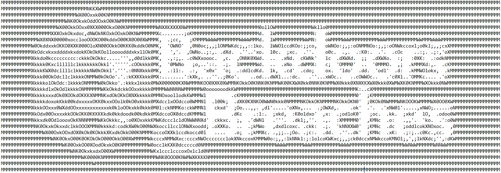
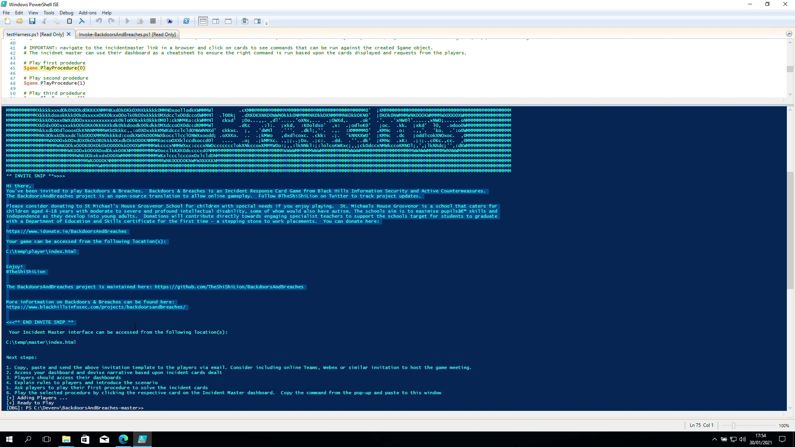
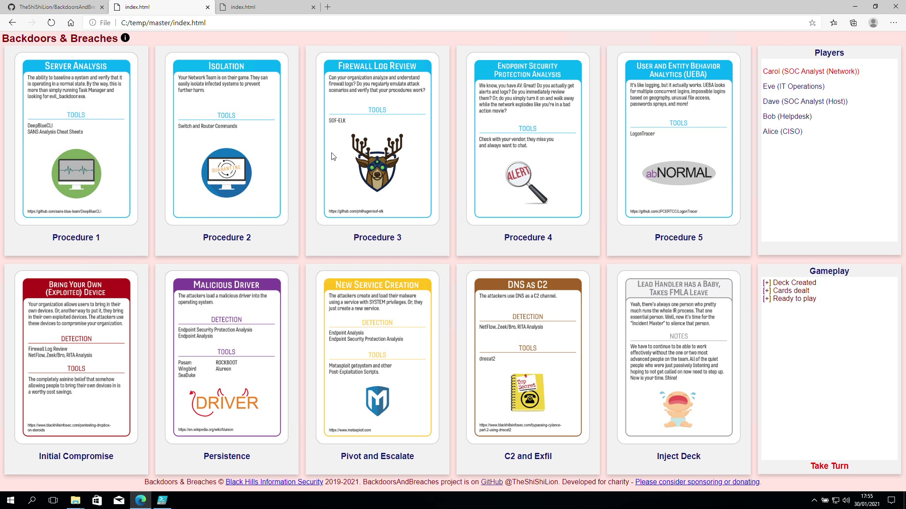
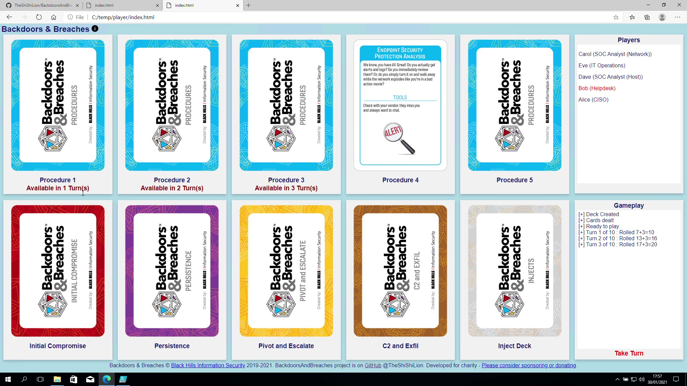
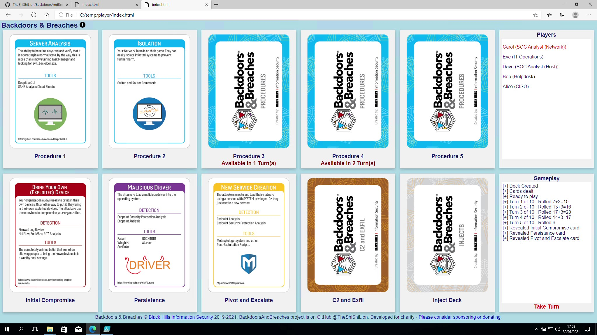
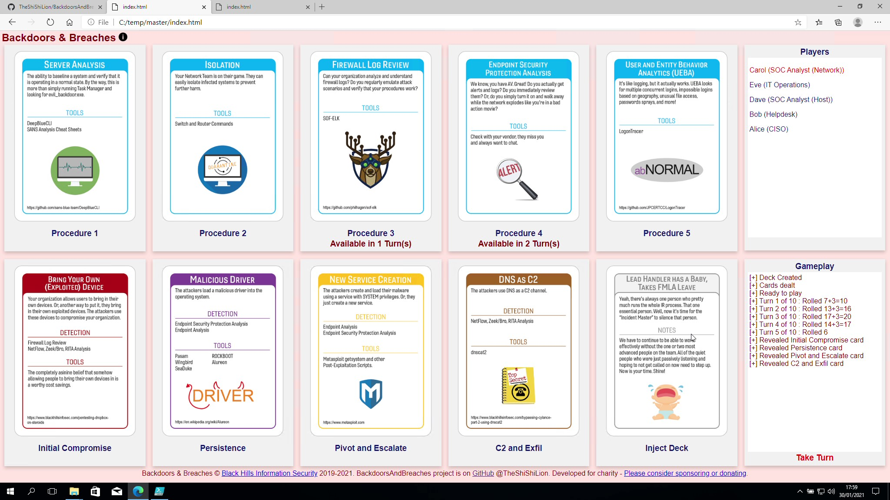

<a href="https://www.idonate.ie/BackdoorsAndBreaches" target="_blank"></a>


# Backdoors & Breaches
Open-Source PowerShell module to allow online play of Backdoors & Breaches card game devised by <a href="https://www.blackhillsinfosec.com" target="_blank">Black Hills Information Security (BHIS)</a>.  Dealing cards, player role assignment and turns, injects, procedures played, dice rolls and incident card reveals are tracked and displayed on dashboards.  Participants get to fully concentrate on the incident response gameplay.  Realistic scenarios are generated based upon cards dealt.  Security incident response team members use their knowledge of controls, processes and procedures in each tabletop exercise.  The direct benefit is for players to identify priorities, assumptions, biases or gaps in controls feeding into security incident preparation.

## Project Goals
To create an Open-Source PowerShell module to allow remote working teams to play Backdoors & Breaches together online and hopefully raise some money for <a href="https://www.idonate.ie/BackdoorsAndBreaches" target="_blank">charity</a> in the process.  The project should allow a team play Backdoors and Breaches with minimal effort, additional infrastructure or investment in time.  Coordination and discussion takes place via separate medium such as Microsoft Teams, Webex or similar online meeting facility.  Dashboards are available for both the Players and the Incident Master.  These are periodically updated based upon the how the gameplay progresses with incident cards being revealed when the Incident Master decides.  There is already a backlog of features in consideration and periodic updates and enhancements are planned.  Follow @TheShiShiLion on Twitter to keep updated on new releases.

## Please donate to an excellent Charity
Please consider making a donation to a charity very close to the developer’s heart.  St. Michaels House Grosvenor is a school that caters for children aged 4-18 years with moderate to severe and profound intellectual disability, some of whom would also have autism. The schools aim is to maximise pupils’ skills and independence as they develop into young adults.  Donations will contribute directly towards engaging specialist teachers to support the schools target for students to graduate with a Department of Education and Skills certificate for the first time - a stepping stone to work placements.

You'll find the details on <a href="https://www.idonate.ie/BackdoorsAndBreaches" target="_blank">idonate.ie</a>

If you are a company and planning to use this project as part of ongoing incident training and preparedness - why not support and encourage future developments by making a donation or becoming a project sponsor (coming soon).

## Credits
Backdoors And Breaches card game was devised by Black Hills Information Security.  The team at BHIS have been super supportive in the development of this project.  Particular thanks to Deb, Jason and John for the encouragent.  You can find full details on the BHIS <a href="https://www.blackhillsinfosec.com/projects/backdoorsandbreaches/" target="_blank">website</a> .

## A word on Motivations
- Allow my team, who are largely working remote, easily play Backdoors & Breaches
- There are many teams working in similar circumstances who could benefit
- Contribute something positive to the community
- Maybe generate some donations for a charity very close to home

## Design Considerations
A web application would be ideal, with user registration and game scheduling etc but there were some constraints:
- Limited time to invest
- This has to be super simple to install and run
- Don't want to be reliant upon a particular OS, Web/DB technology stack
- By default - minimal installation or infrastructure requirement to play
- By default - no new attack surface to consider or manage
- No registration required for players - the incident master will pre-register names
- Keep it very simple in terms of "installation" i.e., import a module or download to a folder and run.
- Keep it very simple in terms of running a game.  Make it intuitive for the Incident Master.
- It should support novice Incident Master gameplay including some nudges on the next steps.
- Automate dice rolls and display results supporting gameplay
- Assumption is the Incident master will still drive the narrative of the overall incident
- Incident Master still decides whether to reveal an incident card based upon Blue Team rationale and explanation of procedure

## Contribute
All positive feedback and suggestions for improvement are appreciated.  Please also feel free to contribute to the code base.

## License
This project is developed under MIT License.  The only additional request from the developer is to continue to include the donation options for St. Michaels House Grosvenor School.

## Dependencies
Developed and tested on Windows 10.  Requires PowerShell 5.0 or above.  Optional remote file transfer functionality is dependent upon WinSCP API library.  Instructions for remote file transfer can be found at the bottom of this file and in the FileXfer.example.config in the package.

# Quick Start Guide from direct GitHub download

1. Download the code package to a local directory using the preferred means on GitHub.  Unzip to a local directory if required.
2. Open a PowerShell Window
3. Cd to the BackdoorsAndBreaches-master package directory
4. Open the testHarness.ps1 file in PowerShell ISE or Visual Studio Code and follow the instructions

## Installation Quick Start and other guides

[](https://youtu.be/jYA5fQv0eFM "Backdoors & Breaches PowerShell Module install and test run")

Instructions and guidance on playing the card game can be found here: https://www.blackhillsinfosec.com/projects/backdoorsandbreaches/

[](https://youtu.be/TAiJVr0zWMw "Backdoors & Breaches Card Game Introduction")

[](https://youtu.be/cCr8R1yrx4M "Playing the Backdoors & Breaches Card Game")

## Installation from GitHub
1. Download the code package to a local directory using the preferred means on GitHub.  Unzip to a local directory if required.
2. Open a PowerShell Window
3. Cd to the BackdoorsAndBreaches-master package directory
4. Run the PowerShell module import as follows

```powershell
PS> Import-Module .\BackdoorsAndBreaches\BackdoorsAndBreaches.psd1 -Force
```

You'll find a test harness script that may be helpful in the root of the code package directory.

## From PowerShell Gallery

Coming Soon

## Detailed Instructions: Shall We Play A Game?
Now the game is installed it's time to play.

Step 1. If it doesn't already exist - create the directory where the Incident Master game files will be created or updated e.g., c:\temp\master

```powershell
PS> If(!(test-path "c:\temp\master")) { New-Item -ItemType Directory -Force -Path "c:\temp\master" }
```

Step 2. If it doesn't already exist - create the shared directory where players may access the game files from.  This MUST be different from the Incident Master path e.g., s:\SomeShareDrive\temp\player

```powershell
PS> If(!(test-path "c:\temp\player")) { New-Item -ItemType Directory -Force -Path "c:\temp\player" }
```

Step 3. At the PowerShell prompt type the following:

```powershell
PS> $game =Invoke-BackdoorsAndBreaches -Players "[Enter name of players separated by a comma]" -IncidentMasterOutputPath "[Path from Step 1]" -PlayerOutputPath "[Path from Step 2]" [-Verbose]
```

Example:

```powershell
PS> $game =Invoke-BackdoorsAndBreaches -Players "Alice,Bob,Carol,Dave,Eve" -IncidentMasterOutputPath "C:\temp\master" -PlayerOutputPath "C:\temp\player"
```


Step 4: The script will generate an invitation template which can be shared via email with the players being invited to play.  This includes a link to where the player dashboard can be accessed.  Copy and paste text between the "** INVITE SNIP **>>>>" and "<<<** END INVITE SNIP **" into an email and forward to the players.  The player dashboard has a blue background.



Step 5: The incident master will follow a different link (also displayed when the script module is run).  This Incident Master dashboard has a red background.  Once created - navigate to the incidentmaster link in a browser and interact with the cards to see commands that can be run against the created $game object.  These should be copied and pasted to the PowerShell window where the game was initated as commanads are run against the now pre-existing $game object.



Step 6: The incident master should introduce the game objectives and talk the players through the planned gameplay.  It may be helpful to show the instructions page from BHIS which can be accessed through the "i" image beside the top banner on the dashboards.  The specific scenario the incident master invents (typically based upon the initial access card) should be introduced.  Give the players 5 minutes to familiarise themselves with the procedure cards they've been dealt and ask any questions.  When the players are comfortable the incident master should ask what procedure card they want to play -OR- a different procedure not represented by a card (which won't give a +3 modifier to the next dice roll).



Step 7(I): The incident master should confirm the procedure the players want to play by name.  IMPORTANT: The incident master doesn't need to remember which method to call against the $game object.   They can click the related card in the incident master (red) dashboard.  A dialogue will appear with what command to run.  They can then copy and paste the command into the PowerShell terminal used to initiate the game.  Examples of what will appear in the cut-and-paste window follows:

```powershell
# Play first prodedure
PS> $game.PlayProcedure(0)

# Play second prodedure
PS> $game.PlayProcedure(1)

# Play third prodedure
PS> $game.PlayProcedure(2)

# Play fourth prodedure
PS> $game.PlayProcedure(3)
```

The incident master will then be prompted with next steps as follows:

```
> Turn (1) : Ask players to describe the procedure they want to use.  Press [RETURN] to proceed when done:
```

WARNING: Once the incident master presses [RETURN] the dice will be rolled and result displayed on both dashboards.

```
> Turn (1) : Rolled n including modifier - can players solve a card?  Press [RETURN] to proceed when done:
```

Step 7(II): If the players don't want to play one of their procedures they can opt to play/describe one of their own known procedures.  However, they will not receive the +3 modifier on the dice roll.  To do this the incident master can click the "Take Turn" text at the bottom of the Gameplay box on the incident master (red) dashboard.  Then copy and paste the text that appears in the dialogue into the PowerShell window used to initiate the game. This will initiate the turn taking for the players without using a procedure.

```powershell
# Play a prodedure of the players choice/invention/experience (no card selected - no +3 modifier)
PS> $game.TakeTurn($false)
```
Step 8: The incident master then decides if

    (a) the players roll is greater than 10 AND
    (b) the description of how the procedure will be applied sufficiently describes the expectations for investigation AND
    (c) the procedure as described would positively identify one of the target game cards - initial compromise, Persistence, Pivot and Escalate, C2 and Exfil

The decision can be made to reveal an incident card.  Examples are as follows:



```powershell
# Players solve Initial Compromise - reveal card
PS> $game.RevealInitialCompromise()

# Players solve Persistence - reveal card
PS> $game.RevealPersistence()

# Players solve Pivot and Escalate - reveal card
PS> $game.RevealPivotAndEscalate()

# Players solve C2 and Exfil - reveal card
PS> $game.RevealC2AndExfil()
```


Step 10: Repeat steps 7 and 8 with the players until 10 turns have been take or the players solve the 4 incident cards.  The incident master may want to introduce their own story narrative as the game progresses.

## Hosting/uploading the files online via FTPS (demo implementation)

This is completely optional and likely only relevant where players are from outside your organisation/network.  Most relevant where a network shared folder might not be available for access the "player game file".

The Incident Master and Player files still need to be generated locally before upload so follow Step 1 and Step 2 from the instructions above.

NOTE: Playing the game will automatically create and upload the "player" and "incidentmaster" files if they don't already exist.

The $env:PSModulePath environment variable contains a list of folder locations that are searched to find modules and resources.  Copy the sample FileXfer.example.config file from the module "input" subdirectory to your desktop for editing.

```
$game=Invoke-BackdoorsAndBreaches -Players "[Enter name of players separated by a comma]" -IncidentMasterOutputPath "[Path from Step 1]" -PlayerOutputPath "[Path from Step 2]" -FileXferConfig "[Path to Config file]" -Verbose
```

Example:

```powershell
PS> $game=Invoke-BackdoorsAndBreaches -Players "Alice,Bob,Carol,Dave,Eve" -IncidentMasterOutputPath "C:\temp\master" -PlayerOutputPath "C:\temp\player" --FileXferConfig "C:\Users\Smith\Desktop\fileXfer.config"  -Verbose
```

